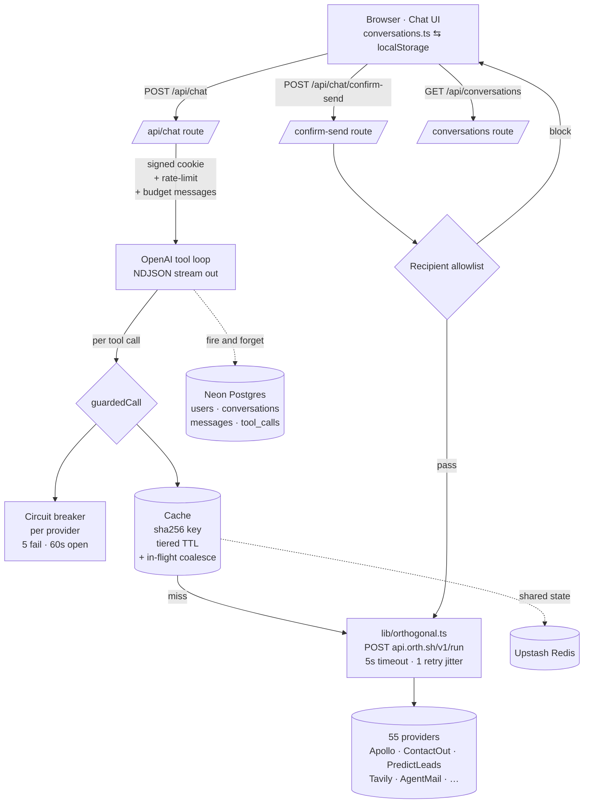

# Orthogonal Chat

**Live demo:** [lumiere-orthogonal.vercel.app](https://lumiere-orthogonal.vercel.app)
**Repo:** https://github.com/SankrityaT/lumiere-orthogonal

A chat app where the assistant calls Orthogonal's unified API catalog (55+ providers behind one key) and renders real results inline.

**Demo arc:** `Find 3 senior engineers at Stripe → enrich their contact info → check Stripe's recent funding signals → search the web for Stripe news → draft an outreach email (you pick the recipient, the agent never does).`

---

## Approach

The brief asks five questions: context bloat, persistence, system design, concurrent users, resilience under failure. I treated those as the rubric and built the engineering-judgment surfaces explicitly.

### Tool surface (5 dedicated + 2 escape hatches)

Orthogonal exposes 55 verified APIs. I wired five tools that map cleanly to the GTM-chat arc, plus two universal escape hatches so the agent can reach the other 50:

| Tool | Provider | What it does |
|---|---|---|
| `apollo_search_people` | Apollo | Search 210M+ contacts by role/seniority/location; optionally enrich top N with email/phone |
| `enrich_contact` | ContactOut | Single-person enrichment by LinkedIn / email / name+company |
| `company_signals` | PredictLeads | Parallel fetch of funding events + job openings + news for a domain |
| `web_search` | Tavily | Live web with cited results |
| `send_email` | AgentMail | Draft preview with **user-supplied recipient** + server-side allowlist (see §Trade-offs) |
| `orth_discover` | Orthogonal `/v1/search` | Natural-language catalog search |
| `orth_call` | Orthogonal `/v1/run` | Direct passthrough to any of the 55 providers |

### The proof: live dual-track context bars

The header carries two stacked horizontal bars, both computed with the same `o200k_base` tokenizer (`js-tiktoken`):

- **ctx** — what we actually send to OpenAI after sliding-window trim + tool-result summarization
- **naive** — what a chatbot without compaction *would have* sent (full untouched history, raw tool JSON blobs)

When naive crosses `MODEL_MAX_TOKENS` the bar turns red and shows the overflow in tokens. When the compaction algorithm fires, an inline italic notice in the chat says exactly what it did: *"summarized 6 tool results — sent 31k tokens. Without compaction we'd be at 98k tokens (76% of limit)."* No estimation, no mocked values.

---

## System design

### Architecture



### Schema (Drizzle, 4 tables)

```ts
users          (id PK uuid, created_at)                    // anonymous, cookie-keyed
conversations  (id PK, user_id FK→users, title, created_at, updated_at)
                ↳ index (user_id, updated_at)              // covers the sidebar
messages       (id PK, conversation_id FK, role, content,
                tool_payload jsonb, token_count, created_at)
                ↳ index (conversation_id, created_at)
tool_calls     (id PK, conversation_id FK, message_id FK,
                tool_name, provider, path, args jsonb, response jsonb,
                error, price_cents int, cached_from_id, latency_ms, created_at)
                ↳ index (conversation_id, created_at)
                ↳ index (provider, created_at)             // covers analytics
```

The `tool_calls` table is the analytics ledger — one row per guarded call, with `price_cents` (what we paid Orthogonal), `cached_from_id` (the original row if we served from cache), and `latency_ms`. `GROUP BY provider, date(created_at)` answers "what's our hit rate per provider this week and cost per user-turn" in one query.

### Request lifecycle

1. Browser POSTs `/api/chat { messages, conversationId }` with signed `orth_uid` cookie.
2. Route resolves user → checks per-user **rate limit** (20 req/60s sliding window via Upstash) → if breached, 429.
3. Builds `[system_prompt, ...client_history]` and passes through **`budgetMessages()`** — real `o200k_base` tokenization, tracks both `actual_tokens` (post-trim) and `naive_tokens` (raw); emits a `context_update` NDJSON event up front.
4. If compaction fired, emits a `compaction` event with `would_have_crashed: bool` so the UI inlines the notice.
5. Streams from OpenAI with `tool_choice: "auto"` + `parallel_tool_calls: true`. Accumulates `tool_calls[]` deltas. On `finish_reason: "tool_calls"` → dispatch.
6. Each tool call → `guardedCall()` → **circuit-breaker gate** → **cache key** `sha256(api+path+sortedQuery)` → **in-flight coalesce** (30s) → on miss, `5s timeout` + 1 retry on 5xx/429 with jitter → record `priceCents` + `latencyMs`.
7. Per call emits `tool_call_start` (running card) then `tool_call_result` (rendered card) with `cached:bool` + `price_cents` so the UI ticks the cost meter in real time.
8. Loop until model returns `finish_reason: "stop"`, MAX 6 iterations, then `done`.
9. Stream closes → **fire-and-forget** `persistTurn()` writes user message + assistant message + per-tool rows to Neon. Errors logged, never block the response.

### Handling context bloat (brief Q1)

The brief asks "as you build and use your chat, you'll notice the context window fills up, both from **API responses** and from **conversation history**. How does your app handle this?"

Those are two distinct sources of bloat. Add the implicit third (the tool catalog itself — 55 tool defs in the system prompt would cost ~10k tokens before the user types anything) and you get **four layers**, each preventing a different source from ever entering the budget:

**L0 — Lazy tool catalog via `/v1/search` (`lib/tools/orth_discover.ts`).**
We register **7 OpenAI function defs** in the system prompt (the 5 dedicated tools + `orth_discover` + `orth_call`), not 55. Total tool-def cost: ~2k tokens. When the agent needs a provider not in the 5, it calls `orth_discover("verify email deliverability")` which wraps Orthogonal's `/v1/search`. That returns the top 6 semantic matches (~500 tokens) instead of preloading all 55 schemas. The catalog **never enters baseline context**. This is the cleverest layer because it solves the bloat by never creating it.

**L1 — Tool-level response summarization (every `lib/tools/*.ts`).**
Each tool extracts only what the LLM actually needs from raw Orthogonal responses:
- Apollo's ~200-field person blob → 7 normalized fields (name, title, company, location, email, phone, linkedin).
- PredictLeads' full event arrays → top 3 per kind (financing / jobs / news).
- `orth_call` raw responses → capped at 4k chars.

A raw Apollo `/api/v1/mixed_people/api_search` for "Stripe engineers" can be **15–25k tokens**. Our normalized payload to the LLM is **~1.5k tokens**. **10–50× reduction at source.** This is the dominant strategy in practice — most conversations never need L2 because L1 already kept things lean.

**L2 — Conversation sliding window + rolling summary (`lib/context.ts`).**
When even pre-summarized history accumulates past `MODEL_MAX_TOKENS - 4k` headroom over a long session:
1. **Step 1 — Summarize old tool messages.** Older tool results get collapsed to `[apollo_search_people prior result, summarized] 10 items`. 5–10k tokens → ~30 tokens.
2. **Step 2 — Drop oldest pairs.** If still over budget, peel oldest non-system user+assistant pairs.
3. **System prompt + current turn are never dropped.**

Tokenized with real `js-tiktoken` `o200k_base` (the encoder GPT-5 uses), not 4-chars-per-token estimation.

**L3 — Dual-track UI accountability.**
Track `actual_tokens` (what we actually sent) vs `naive_tokens` (what we WOULD have sent if we skipped L1+L2) in parallel. Both visible in the chat header as `CTX` and `NAIVE` bars. When `naive > model_max`, the naive bar turns red with `+Xk overflow` — visual proof that without our handling, the request would have 400'd. Compaction events surface as inline italic notices in the chat thread: *"summarized 4 tool results — sent 23k. Without compaction we'd be at 87k (68% of limit)."*

A `COMPACTED · N` counter aggregates across the conversation. Nothing is a vanity meter.

**Why this answer fits the brief.** "API responses" → L1 handles it at source. "Conversation history" → L2 handles it at the budget boundary. Tool-catalog bloat (the implicit third) → L0 prevents it entirely. L3 makes all three observable. Each line of the rubric maps to a specific architectural layer.

#### Output quality (the L1 trade-off)

L1 is field-projection, not arbitrary truncation. Apollo's ~200-field person blob gets cut to 7 high-signal fields (`name, title, company, location, email, phone, linkedin, enriched`); we drop internal ids, audit timestamps, org-hierarchy nesting, and other noise the LLM rarely reasons about. PredictLeads keeps the top 3 most-recent events per kind. ContactOut keeps an 8-field envelope.

Honest concern: a query that depends on a dropped field (employment history, skills, education, social handles, the body of a news article) would silently produce a thinner answer. Three things mitigate it:

1. **Verbose escape valve on every dedicated tool.** Apollo / ContactOut / PredictLeads each accept `verbose: true`. When set, the tool passes the full raw record per result instead of the projection. The system prompt tells the agent to flip it on a retry when its first answer feels thin — *not* preemptively, because verbose blows context up by 10×. The L2 sliding window absorbs that bloat if it happens. So the agent trades context for completeness *per call, on demand*.
2. **`orth_call` as the final escape.** If even verbose isn't enough, the agent can call `orth_call(api, path, body)` directly against any of the 55 providers and read the raw response (capped at 4k chars). No field is permanently inaccessible — just deferred.
3. **The cards in the UI carry the full data.** `cardPayload` (what the user sees) isn't projected. The LLM works off the summary, the human reads the full profile. So even if the model misses something, it's still on screen.

What's still missing (in *what I'd do with more time*): an eval harness that replays canned prompts against a frozen model + tool snapshot and gates merges on response-quality regressions. Without that, "verbose retries fix it" is a claim, not a measurement. The hook is there; the offline scoring loop isn't.

### Handling concurrent users on the same APIs (brief Q4)

The brief asks "how would you handle multiple users hitting the same APIs concurrently?" The key word is **same**.

Two layers, both keyed by `sha256(provider + path + sortedQuery)` so identical payloads dedupe regardless of who's asking:

1. **In-flight coalescing (in-process, 30s).** If two requests for the same key arrive within 30s, the second `await`s the first's promise. One upstream call, two responses. Directly answers the "same time, same query, different users" case.
2. **Redis response cache (tiered TTL).**
   - **24h** for enrichments (Apollo `people/match`, ContactOut enrich) — stable data
   - **5min** for news / financing / web search — high churn
   - **1h** default

Cache hits return `priceCents: 0` and surface a `cached` badge in the UI tool card. In `tool_calls` they get a `cached_from_id` pointing at the original row.

I verified the cache layer live during smoke: same Apollo search fired twice in one conversation showed a `cached` badge on the second card. ✓

### Handling slow / down APIs (brief Q5)

The brief asks "what happens when an API is slow or down? How does the chat behave?"

**Server side:**
- **Circuit breaker per provider** (`lib/circuit-breaker.ts`). 5 consecutive failures → open for 60s. While open, calls fail-fast with a synthetic "Apollo circuit open (45s left)" response so the agent can adapt mid-turn instead of waiting through every timeout.
- **5s timeout** per Orthogonal call via `AbortController`.
- **1 retry with jitter** on HTTP 5xx / 429. Sleep 150–350ms, retry once.
- **Per-tool isolation.** If Apollo dies, web_search still runs in the same turn (parallel tool calls don't share fate).

**Chat side (UX):**
- Errored tool calls render the card in a **muted red state with the error inline** + a **Retry button** that re-fires the user's last message.
- The rest of the assistant turn keeps streaming — one bad tool doesn't blow up the response.
- The streaming protocol is NDJSON, so partial state arrives in real time: tool 1 succeeds → tool 2 fails (retry button visible) → final text continues to stream.

### Scaling story

| Bottleneck | Today | 100 users | 10k users | 1M users |
|---|---|---|---|---|
| `/api/chat` cost | pay-as-you-go OpenAI + Orthogonal | Same | Same | Same |
| Postgres reads | None on chat path (write-only) | Fine | Fine — `(user_id, updated_at)` index covers sidebar | Read replica for sidebar; partition `messages` by month |
| Postgres writes | 1 conversation upsert + N tool_calls/turn | Fine | Fine — Neon scales | Batch `tool_calls` writes; consider event log → ClickHouse |
| Redis | Cache + rate-limit + drafts | Upstash free | Paid ($10/mo) | Per-region with read-through; promote breaker from process to Redis |
| Circuit breaker | In-process Map per instance | Acceptable | **Move to Redis** so warm instances share state | Already there |
| Send cap | Redis `INCR` per user | Fine | Fine | Fine |
| Tool execution | `Promise.all` in route | Fine | Fine | Long-running tools → **Vercel Queues** so route stays under 60s |
| AgentMail inboxes | One shared `[DEMO]` inbox | Per-tenant inbox | Inbox pool | Per-account inbox at signup + scheduled cleanup |

Two real architectural moves between today and 10k users: **(1)** promote the circuit-breaker state from in-process Map to Redis, **(2)** move expensive tools (deep enrich, web crawl) to Vercel Queues so `/api/chat` stays inside the 300s function timeout. Everything else is index + quota tuning.

---

## Trade-offs (what I chose and why)

**5 dedicated tools + 2 escape hatches, not 55 dedicated.** Wiring 55 sloppy provider modules would have been worse than 5 well-handled ones. The dedicated tools have provider-specific cards, sensible cache tiers, and ergonomic schemas. `orth_discover` + `orth_call` cover the long tail: agent finds the right slug via natural-language search, then calls it directly. The brief evaluates judgment, not coverage.

**Rolled my own `lib/orthogonal.ts` instead of `@orth/sdk`.** The SDK exists (`@orth/sdk` v0.3.2) but has two real problems: (1) its `RunResponse.price` is typed as `string`, but the wire returns `priceCents` as a `number`. (2) it doesn't expose `requestId` or support `method` override for DELETE/PATCH (which AgentMail needs). My 130-line `OrthogonalClient` types the wire correctly, supports method override, and returns `requestId` for logging. Same surface, honest types.

**Anonymous signed cookie, not real auth.** A `orth_uid` cookie signed with HMAC-SHA256 gives stable identity across reloads without account ceremony. For the take-home this is the right scope; for production swap in Clerk (native Vercel Marketplace).

**Drizzle over Prisma.** Both are great. Drizzle wins for serverless: no separate query engine binary, no shadow DB for migrations, schema lives next to the code as TypeScript. The `tool_calls` analytics queries (`GROUP BY provider, …`) are also more natural in Drizzle's SQL-first DSL.

**Agent NEVER picks email recipients.** Defense in depth on `send_email`: the tool schema doesn't even expose a `to` field; the LLM can only set `subject + body + suggested_recipients[]`. The UI shows an editable To: input the user must fill in; Send is disabled until valid. The server enforces an allowlist (`@orthogonal.com`, `@orthogonal.sh`, `@example.com`, the inbox itself, plus optional `EMAIL_SEND_ALLOWLIST` env). A misaligned LLM cannot get an email out to an Apollo contact under any circumstance.

**Graceful degradation, not hard dependencies.** `DATABASE_URL` empty → conversations live in localStorage. `UPSTASH_REDIS_REST_*` empty → cache/rate-limit/breaker fall back to in-process Maps. Anyone can clone, drop in just `OPENAI_API_KEY` + `ORTHOGONAL_API_KEY`, and the app runs. Production wiring is one env flip.

---

## Running locally

```bash
git clone https://github.com/SankrityaT/lumiere-orthogonal && cd lumiere-orthogonal
npm install
cp .env.example .env.local        # fill in OPENAI_API_KEY + ORTHOGONAL_API_KEY at minimum
npm run dev                       # localhost:3000
```

Postgres (optional but recommended):

```bash
# Set DATABASE_URL in .env.local (Neon serverless connection string)
npm run db:push                   # idempotent schema push
```

AgentMail send (optional, for the email demo):

1. In the chat, ask the agent: *"Use orth_call to POST /v0/inboxes with body {username: 'demo-take-home', domain: 'agentmail.to'}"*
2. Copy the returned `inbox_id` into `AGENTMAIL_INBOX_ID` in `.env.local`
3. Optionally set `AGENTMAIL_INBOX_EMAIL` (e.g. `demo-take-home@agentmail.to`) so the "send to yourself" allowlist case works
4. ($2/mo per inbox, auto-deleted after 30d inactivity)

Required env at minimum:

```env
OPENAI_API_KEY=sk-...
OPENAI_MODEL=gpt-5-mini
ORTHOGONAL_API_KEY=orth_live_...
```

Optional but recommended:

```env
DATABASE_URL=postgresql://...
UPSTASH_REDIS_REST_URL=https://...
UPSTASH_REDIS_REST_TOKEN=...
COOKIE_SECRET=<32+ random chars>
AGENTMAIL_INBOX_ID=
AGENTMAIL_INBOX_EMAIL=
EMAIL_SEND_ALLOWLIST=alice@partner.com,@trusted.co
```

---

## What I'd do with more time

- **Eval harness.** Replay top user prompts against a fixed model + tool snapshot, score with an LLM judge, gate deploys on regressions. The brief's "as you build *and use* your chat" line is the right method; automated coverage would protect it.
- **pgvector semantic memory.** Sliding-window compaction is the dumb-fast answer. The right answer for hour-long sessions is embed every summarized turn and retrieve the most relevant 3-5 per new query.
- **Real auth.** Anonymous cookie is fine for the take-home; Clerk (native Vercel Marketplace) is one config switch for accounts that follow users across devices.
- **Multi-tenant workspaces.** Add `workspace_id` on every table + middleware derives it from subdomain. Same code, new tier.
- **Tool-call streaming progress.** Apollo enrich-top-5 takes ~3s; the card sits in "calling Apollo…" the whole time. Could stream per-person enrichment as they complete.
- **Live cost-per-turn breakdown.** Header shows total. The `tool_calls` table can answer per-provider per-turn; expose it as a tooltip ("this turn: Apollo 3× $0.04, ContactOut 1× $0.02").
- **More provider cards.** `orth_call` falls back to a JSON dropdown for the other 50. Production would add typed cards for Tomba, Hunter, Fundable, OpenFunnel, Coresignal.
- **AgentMail polish.** Per-user inbox creation, inbox switcher in settings, draft history, threading. Today's send is one-shot with a shared inbox.
- **Model routing via Vercel AI Gateway.** Currently hard-coded to `gpt-5-mini`. The Gateway would let us fall back to Claude or Gemini on rate limits without code changes.
- **CSV / Notion export.** Sales people want to dump an Apollo search to a sheet. Two endpoints + one button.

---

## File tour

```
lib/
  orthogonal.ts          /v1/run wrapper (typed correctly: priceCents:number, requestId)
  openai.ts              client + tiktoken o200k_base counter
  context.ts             dual-track budgeter (actual + naive + crash detection)
  cache.ts               sha256-keyed two-layer cache (Redis + in-flight coalesce)
  circuit-breaker.ts     per-provider state machine
  rate-limit.ts          @upstash/ratelimit sliding window
  cookies.ts             signed HMAC anonymous uid
  draft-store.ts         pending-email store for the confirm-send flow
  redis.ts / db/         lazy clients, graceful fallback
  tools/
    _runtime.ts          guardedCall — gate → cache → timeout → retry → record
    _types.ts            tool module interface
    apollo / contactout / predictleads / websearch /
      agentmail / orth_discover / orth_call / index.ts

app/
  api/chat/route.ts                 the loop — OpenAI streaming, tool dispatch, NDJSON
  api/chat/confirm-send/route.ts    user-clicked email send with allowlist gate
  api/conversations/route.ts        list (db-backed, graceful)
  api/conversations/[id]/route.ts   single conversation with reconstructed history
  chat/page.tsx                     shell + state
  page.tsx                          landing

components/
  ChatArea.tsx             live two-bar context meter + cost meter + event handlers
  AIMessage.tsx            renders tool cards + compaction notices + streaming text
  CompactionNotice.tsx     inline italic notice when sliding window or summarization fires
  tool-cards/index.tsx     Apollo / Contact / Signals / Web / Email-draft / Discover / Generic

drizzle/                   migrations
```
